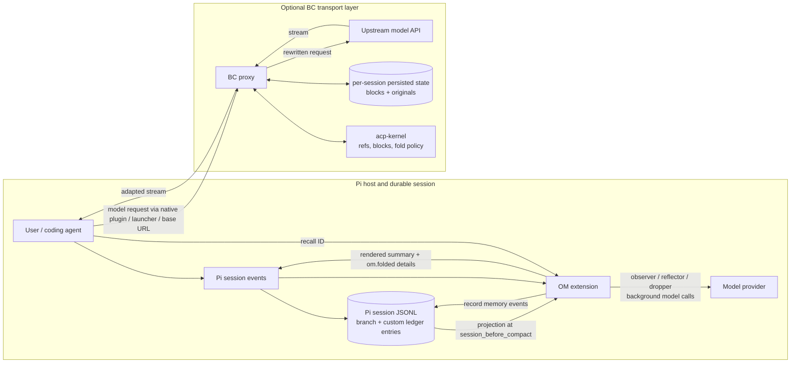
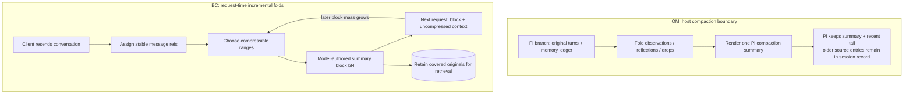
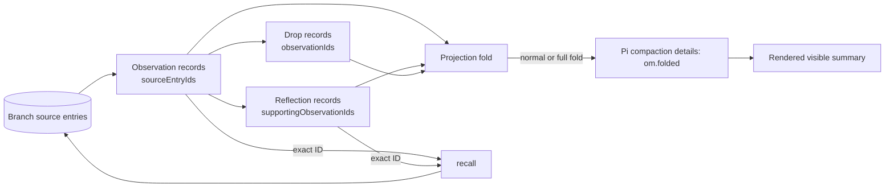
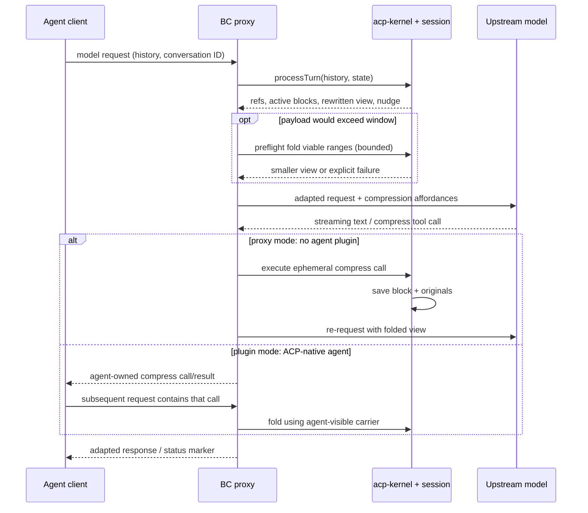
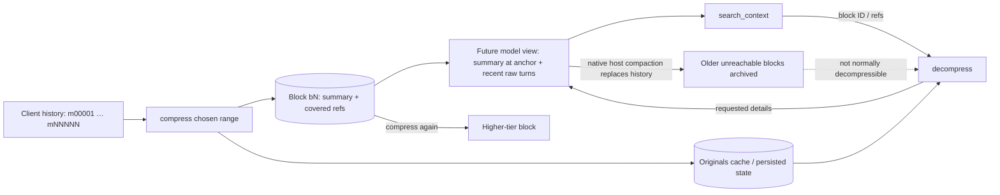
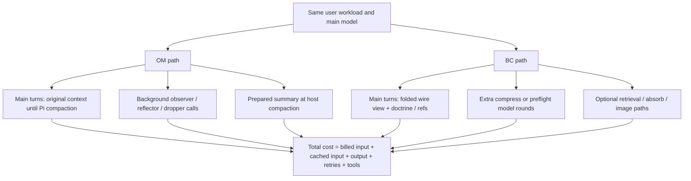

# pi-observational-memory vs. billion-context: an implementation-level comparison

**Research snapshot:** 2026-09-27 UTC. **Compared versions:** the locally installed `pi-observational-memory` **3.1.4**, byte-identical in `src/` and `README.md` to its published [3.1.4 tag](https://github.com/elpapi42/pi-observational-memory/tree/e7d77dc9a8305acb8054124e47662b3c766c2321) (`e7d77dc`); `billion-context` **0.1.163** at [`86e0b68`](https://github.com/ranxianglei/billion-context/tree/86e0b684d58e79a4679aa56fa0b862f516efea6b). The observational-memory `master` branch had advanced to `e891667` and differs in three worker API adapters; **this report uses the installed release, not that later branch**. The comparison covers the `billion-context` repository, including its bundled Pi integration, **not** the separate in-process `billion-context-pi` project. [O0] [B0] [B1]

**Evidence key:** **Fact** = verified in pinned source/configuration; **test** = exercised by the repository's local tests; **author measurement** = the project's own reported experiment, not independently reproduced; **inference** = implication of several code paths; **unknown** = no direct comparative measurement. Source links are indexed at the end. The planned independent-agent research failed because the configured researcher requested an unavailable `safe_bash` tool. Its run was stopped; the findings here were verified by direct code inspection and local tests instead.

## Executive judgment

These are **different layers of context management**, not drop-in replacements:

- **pi-observational-memory (OM)** builds a *source-linked, branch-local working memory* **inside Pi's session ledger**. Background model workers distill observations, reflections, and drop decisions; at a Pi compaction boundary, it renders the prepared projection without another model call. A `recall` tool traces an observation or reflection ID to its underlying session entries. It is Pi-specific. [O1] [O2] [O3] [O4]
- **billion-context (BC)** is a *model-traffic compression system*. A local proxy plus `acp-kernel` tracks message references, folds selected ranges into nested summary blocks, rewrites the next model request, and retains covered originals for `decompress`/`search_context`. Its native Pi plugin or `bili pi` launcher connects Pi to that proxy; other clients can also use it. [B2] [B3] [B4] [B5]
- **Recommendation, conditional:** choose **OM** if the central requirement is Pi-native continuity, inspectable decisions, and quick host compaction; choose **BC** if it is bounded per-request context across clients, explicit range compression, and block-level retrieval. **Do not assume installing both is additive.** BC deliberately cancels Pi's *automatic threshold/overflow* compaction when it carries the session, but leaves *manual* compaction alone; OM's proactive `ctx.compact()` takes that manual path, so both mechanisms can operate on the same history. This interaction is a source-level **inference**, not a tested co-installation result. [O5] [B6] [P1]
- **No OM-vs-BC head-to-head quality, cost, cache-hit, or latency benchmark was found.** BC's published production figures and pilots are informative **within its own setups**, not a ranking against OM. [B17]

## 1. Two system boundaries



**The overlap is the model's available context; the ownership differs.** OM's source of truth is Pi's selected branch and extension custom entries. BC's source of truth for compression is a proxy session keyed to the conversation and reconstructed model traffic. BC does not automatically ingest OM's ledger as a special memory format; OM does not manage BC's block store. If Pi's outbound traffic goes through BC, OM's worker model calls may also be routed through it depending on their model/transport path; that routing has **not** been established for every provider. [O6] [B3] [B7]

| Dimension | OM 3.1.4 | BC 0.1.163 |
|---|---|---|
| Host and install | Pi extension via `pi install npm:pi-observational-memory`; requires Pi ≥0.81.0 for `agent_settled`. [O7] | `bili` npm CLI/proxy; `bili plugin install pi`, `bili pi`, or `/bili/` URL route. README also recommends the **separate** `billion-context-pi` for an in-process Pi-only route. [B2] [B8] |
| Execution boundary | Pi lifecycle callbacks and model workers; no independent request proxy. [O1] | HTTP proxy and protocol adapters for Anthropic, OpenAI Chat, Responses, and a Google-format path (features vary by wire); optional native host plugin/launcher. [B3] [B8] |
| Primary object | Observation, reflection, coverage marker, drop event, folded Pi compaction details. [O8] | Raw message ref `mNNNNN`, compressed block `bN`, summary, active range, originals cache, optional content store. [B4] [B5] |
| Compression unit | A branch projection rendered into Pi's **host compaction** summary; pressure-triggered full folds include eligible reflections and drop state. [O3] [O9] | Selected message ranges or prior blocks become **incremental summary blocks** on the next wire view. [B4] [B5] |
| Retrieval | Exact 12-hex observation/reflection ID → supporting observations and Pi source entries **on current branch**. Not broad semantic search. [O4] | `decompress` by block/range, `search_context` over compressed state, and optional content-addressed `acp_retrieve`; restrictions depend on session/mode. [B5] [B9] |
| Other clients | No. Pi session semantics are required. [O1] | Multiple clients and wire formats, but compatibility varies by client and transport. [B8] |
| Separate state | No extra memory database: session JSONL plus optional debug log. [O6] | Per-session state and covered block originals under XDG data paths; config/cache/log elsewhere. [B7] [B10] |
| Model work | Observer, reflector, dropper use a resolved memory model; prepared compaction itself is model-free unless projection empty. [O2] [O3] | Model writes summaries for chosen ranges, via native tool or proxy loop; emergency preflight can invoke summarization. Extra round trips are possible. [B3] [B11] |

### A useful mental model: where history becomes smaller



**Cache behavior is a mechanism, not a measured cross-project result.** BC tries to preserve the earlier wire prefix by replacing ranges at their anchors rather than repeatedly summarizing the whole conversation. OM prepares a compaction summary ahead of time, reducing the compaction pause, but Pi's compaction still changes the conversation material at that boundary. Actual provider cache-write/read charges depend on model API, prompt layout, and workload. [O3] [B2] [B17]

## 2. OM: lifecycle and data semantics

### 2.1 Trigger and worker pipeline

The installed release registers **both** `agent_start` and `turn_end` for consolidation. It checks whether work is due, avoids concurrent consolidation, and runs **observer → reflector → dropper in sequence**; a stage may skip or abort. It is inaccurate to describe this as a fresh observer call on every turn or as three independent always-running daemons. The default observer threshold is **10,000** progress tokens, reflector threshold **20,000**, proactive host-compaction threshold **81,000 estimated source tokens**, and active observation-pool target/max **10,000/20,000**. These are different clocks and budgets, not one universal context-window fraction. Ratio-based compaction is an **optional** mode (`compactAfterTokensRatio: 0.68`); the default is calibrated/fixed. [O2] [O5] [O10]

```mermaid
sequenceDiagram
  participant Pi as Pi event loop
  participant C as OM coordinator
  participant W as Memory worker model
  participant L as Pi branch ledger
  participant H as Pi compactor
  Pi->>C: agent_start / turn_end
  C->>L: read current branch + coverage clocks
  opt observation due
    C->>W: serialize oldest uncovered source chunk
    W-->>C: observations + source entry IDs
    C->>L: append om.observations.recorded
  end
  opt reflection due and observations available
    C->>W: active observations + existing reflections
    W-->>C: reflections + supporting observation IDs
    C->>L: append om.reflections.recorded
  end
  opt newly reflected; pool above target
    C->>W: propose observation IDs to drop
    C->>L: append om.observations.dropped after validation/cap
  end
  Pi->>C: agent_settled, threshold reached
  C->>H: ctx.compact() (deferred until idle)
  H->>C: session_before_compact(firstKeptEntryId)
  C->>L: fold branch entries to projection
  alt nonempty projection
    C-->>H: custom rendered summary + om.folded details
  else empty projection
    C-->>H: no override; Pi native summarizer
  end
```

Observer input is chunked **oldest first** with a model-window-derived default cap (`20%` of the memory model window; fallback 60,000 estimated tokens). A too-large first entry is excerpted rather than edited in place. It prefers actual context-usage deltas when available and falls back to estimated source-entry tokens; a deliberate empty observation result is backed off to avoid retrying the same unchanged material. Workers can use a configured model or the current Pi model/provider (including registered providers), so their billed tokens and latency must be included in any OM cost study. Defaults allow up to 16 worker turns and request up to 32,000 output tokens, clamped to the model. [O2] [O10] [O11]

The dropper is **selective maintenance**, not deletion of the original transcript: it accepts only existing observation IDs, deduplicates and caps candidates, and ranks by reflection coverage, relevance, age, and proposal order. The ledger records drop events; projections omit dropped observations, while exact recall can still report the source/status when entries remain available. Reflection records must cite supporting observation IDs. [O8] [O12] [O4]

### 2.2 What the model actually sees

The normal projection folds observations covered up to the Pi compaction cut, while reflection/drop maintenance uses the last **full-fold** boundary. When observation pressure reaches `observationsPoolMaxTokens`, a **full fold** includes the branch's eligible reflections and drop decisions. Thus *recorded* memory, *the latest folded memory visible in a compaction*, and *the full branch ledger* are distinct views. `/om:view full` can show entries not yet in the visible folded summary; the first pre-V3-compaction visible view can be empty. An empty rendered summary deliberately falls back to Pi's native summarizer. [O9] [O3] [O7]



`recall` accepts a 12-character hexadecimal ID, resolves matching observations/reflections and their supporting source entries on the **current branch**, and distinguishes missing, partial, and unavailable source cases. It does **not** search arbitrary questions over all past turns. `/om:status` reports coverage/pressure/drift; `/om:view` shows the rendered view and can copy it to the clipboard. `passive: true` disables automatic workers and proactive compaction, **not** the registered compaction hook: a later Pi compaction can still fold whatever V3 entries exist or delegate to Pi if none do. [O4] [O7] [O3] [O5]

### 2.3 Benefits and boundaries

- **Fact:** session-ledger source pointers and a model-free nonempty compaction render make OM auditable and avoid an on-demand summary-model call **at that boundary**. They do not prove the observations themselves are accurate or complete. [O3] [O4]
- **Inference:** long-lived continuity is strongest for facts the workers captured and retained. Unobserved details, excerpted oversized entries, source entries no longer available to the branch, and dropped evidence can still limit what the model sees or what `recall` reconstructs. [O2] [O4]
- **Fact:** V3 does not read V2 memory/settings; migration requires renamed keys and a clean Pi session is the documented safest path. [O7]

## 3. BC: transport, kernel, and retrieval

### 3.1 Request-time path and its two modes

The proxy accepts supported model-API traffic, resolves a conversation identity, builds a kernel view of the resubmitted history, injects its context doctrine/tools or nudge where appropriate, forwards to the upstream provider, and adapts the response stream. On compression, `applyRanges` delegates range validation/folding to `acp-kernel`, caches newly covered originals, and reprocesses the next view. A block may later be folded into a higher tier; this is **not** a literal billion-token model window. [B2] [B3] [B4] [B12]



| Detail | Plugin mode (e.g. BC's Pi-native integration) | Plain proxy `/bili/` mode |
|---|---|---|
| Who executes `compress` | Host agent's registered tool; call and result persist in agent history. | Proxy's internal compress loop; its tool call is ephemeral to the client. |
| Summary carrier | The agent's `compress` call/result. | `acp_summary` re-voiced as a `user` message at the block anchor for strict one-system-message APIs. |
| Preflight | Still available as a last-resort overflow backstop. | Proxy can compress before forwarding even without an agent tool call. |
| Pi-specific compaction | Native Pi plugin can cancel Pi threshold/overflow passes **only if** it judges this conversation to be proxy-carried. | No Pi lifecycle hook from a plain URL client. |
| Consequence | The client sees compression as an actual tool action. | The client does not own the internal tool action; the proxy owns the reconstructed view. |

The mode is determined by a plugin marker on the request, **not merely by launching the CLI**; a launcher that only redirects traffic still uses proxy-mode execution. The mode is sticky per session, with a limited plain→plugin upgrade path. This is distinct from the separate, in-process `billion-context-pi` extension; BC explicitly warns against installing its own Pi-native integration alongside **that** legacy extension. [B2] [B6] [B8]

### 3.2 Fold policy, limits, and recovery

BC exposes model-authored `compress` ranges (`startId`, `endId`, `summary`), plus `decompress`, `search_context`, and `acp_status`; optional features include `absorb` for large tool results, protected rules/latest-tool snapshots, content-addressed retrieval (`acp_retrieve`), and image pre-compression. The optional features have different loss/recovery semantics: **absorb is lossy**, block originals are cached for later decompression, CCR's oversized tool-result placeholder can be retrieved by ref, and downscaled images can request `image_full` when enabled. **CCR is opt-in** (`compress.ccr.enabled: true`) and has wire/mode restrictions; do not treat all these mechanisms as enabled by default. [B2] [B5] [B9] [B13]

A normal model-triggered compression can consume additional upstream rounds. The general compress loop caps at **10 rounds**; emergency preflight caps at **16 rounds** and may stop with a failure when the request still cannot fit. Context limits, protected zones, minimum range sizes, growth nudges, and provider/model overrides affect when it actually folds. There is no guarantee of a fixed ratio or a particular model spontaneously using retrieval correctly. `acp_status` is preferable to a text marker alone as proof a block landed; BC documents model-emitted fake-looking markers as an observed failure mode. [B2] [B11] [B14]

The proxy persists per-session kernel state and block originals under `~/.local/share/billion-context/sessions/` by default (XDG and `BILI_SESSIONS_DIR` can relocate it), with `~/.config/billion-context/billion-context.json` as the default config path. Writes use a temporary file and rename; an in-memory session cache is not the only copy. The proxy **does not** duplicate a full raw transcript in that state file: it stores blocks/original caches and a bounded recent view, while the agent may separately retain its own history. Session ID comes from client/plugin signals or a history-prefix-affinity fallback; a derived child can link read-only to a parent's compressed state when lineage is supplied. [B7] [B10] [B15]



**Reversibility has a boundary.** `decompress` retrieves cached `one`/`full` views and can target ranges; it does not permanently expand an active block by merely reading it. But blocks rendered unreachable after **native host compaction** are archived, and `resolveDecompress` refuses pre-compaction archives. If an originals cache or content-store entry is unavailable, the general phrase “lossless compression” does not guarantee access to that detail. [B5] [B16]

### 3.3 Operations and compatibility costs

A local proxy, routing/identity, per-protocol stream adapters, persistent state, and optional client-specific launchers are additional moving parts relative to a Pi-only extension. BC's npm package is `0.1.163` at this snapshot and pins **`acp-kernel` 0.0.97** as a build-time dependency bundled into the CLI; kernel `processTurn`/`applyCompression` own much of the actual fold policy, while BC owns the transport, persistence, and host adapters. Auto-update checks default on; auto-restart is off unless configured. An unrecognized endpoint can pass through without compression; native Pi ownership checks leave Pi compaction enabled when BC cannot establish that traffic is routed through its proxy. These are useful failure boundaries, but they mean “installed” does not imply “this request was compressed.” [B0] [B3] [B6] [B18]

## 4. Direct comparison by capability

| Question | OM | BC | What the evidence supports |
|---|---|---|---|
| Preserve a coding decision across Pi compactions? | Observation/reflection retained in a folded Pi summary, with source IDs. | Summary block can retain it under doctrine/policy; explicit rules optional. | Both *can* preserve it; no paired quality measurement. [O3] [B2] |
| Retrieve an exact old detail? | `recall(id)` if it was observed/reflected and its source is available on the branch. | Search block/ref then decompress cached original; optional CCR retrieval. | Different retrieval indexes; neither guarantees spontaneous model retrieval. [O4] [B5] [B17] |
| Compress a single growing session before Pi's host compaction? | Precompute memory, then replace at a host boundary; cannot incrementally fold arbitrary wire ranges. | Incrementally fold selected ranges/blocks in the wire view, with a preflight backstop. | BC specifically addresses per-request context growth. [O3] [B4] |
| Make Pi host compaction fast? | Nonempty prepared projection renders without model call at the boundary. | Often avoids Pi's auto compaction for carried sessions, but may spend model calls/latency on proxy folds. | Different latency placement; no paired wall-clock result. [O3] [B6] [B11] |
| Cross-client use? | Pi-specific. | Pi plus supported clients/wires; integration differences matter. | BC has broader scope, not universal compatibility. [O1] [B8] |
| Durable provenance? | Memory IDs → observation/reflection → Pi source entry IDs. | Block IDs/message refs → cached covered originals; lineage for derived sessions. | OM is fact/decision-centric; BC is range/message-centric. [O8] [B5] [B15] |
| Bound model context? | Pi compaction and memory-pool controls; cannot guarantee no overflow between host events. | Kernel folds, protected zones, preflight; still fails when nothing viable fits. | BC owns the request boundary but has explicit failure cases. [O5] [B11] |
| Minimize billed tokens? | Worker calls cost tokens; prepared summary may save later context. | Doctrine/nudges/extra fold calls cost tokens; smaller wire views can save repeated input. | **Unknown head-to-head.** Need matched workloads and full billing. [O2] [B17] |
| Cross-session/global search? | Branch-local exact-ID recall, not global semantic search. | Proxy has session state, cross-session search/parent fallback in supported modes; not a universal semantic memory index. | Neither is an unrestricted knowledge base. [O4] [B9] [B15] |

### Budget topology (not a cost estimate)



Neither “OM saves the compaction wait” nor “BC reduces repeated prompt context” alone establishes lower **total** cost or better task completion. Those hypotheses need a controlled comparison.

## 5. Co-installation in Pi: the important interaction

**Fact:** OM proactively calls `ctx.compact()` on `agent_settled` when its estimated post-compaction source progress crosses the configured threshold. In the installed Pi implementation, that API emits `session_before_compact` with reason **`manual`**. BC's Pi plugin cancels only **`threshold`** and **`overflow`** events, conditional on evidence that the conversation traverses BC; it returns no cancellation for `manual`. OM's registered compaction hook can therefore provide its custom summary even when BC carries Pi's model traffic. BC later marks a native compaction boundary and archives now-unreachable blocks. [O5] [P1] [B6] [B16]

```mermaid
sequenceDiagram
  participant OM as OM agent_settled hook
  participant PI as Pi compactor
  participant BC as BC Pi plugin
  participant PX as BC proxy state
  OM->>PI: ctx.compact() after 81K estimated source tokens (default)
  PI->>BC: session_before_compact(reason="manual")
  BC-->>PI: undefined (manual remains user/host-owned)
  PI->>OM: session_before_compact(...)
  OM-->>PI: prepared OM summary, if nonempty
  PI->>PI: append native compaction entry
  PI->>BC: session_compact
  BC->>PX: mark boundary; next processTurn archives unreachable blocks
  Note over OM,PX: Handler order illustrative; inference, no joint runtime test
```

**Inference, not a verified defect:** OM-triggered compaction may defeat the intended “BC instead of Pi's automatic compaction” posture and create a second compression boundary. The diagram's handler order is illustrative; neither hook cancels this `manual` case under ordinary conditions. It does **not** mean BC necessarily corrupts OM memory: OM's ledger and BC's block store are distinct. It does mean older BC blocks may become inaccessible through normal `decompress` after Pi replaces their source range; Pi's new OM summary is then a different recovery route. Handler ordering, provider routing, and real session lineage must be tested before recommending coexistence. [O3] [B6] [B16]

BC's warning/installer logic about **`billion-context-pi`** specifically does not establish any integration contract with **`pi-observational-memory`**. For a conservative Pi deployment, pick one primary context owner first. If experimenting with both, start from a disposable session, check `acp_status` and `/om:status` before/after the first OM-triggered `ctx.compact()`, and verify old-detail retrieval rather than inferring success from a status marker. [B8] [B2]

## 6. What the quantitative evidence actually says

### BC author-reported evidence, **not** OM-vs-BC evidence

The BC paper describes a **single-user observational deployment** across several hosts: **4,843 sessions, 174,327 model calls, 18.76 billion cumulative input tokens** across the corpus. Cumulative input includes repeated re-sending/cached reads; it is **not** one model's context window or one observed session. Production telemetry is primarily about context boundedness and costs, not independently graded code quality; its underlying dataset/workspace were not public at this snapshot. The separately advertised **28.6B-token, 106-day** one-session capacity is a **simulation fitted to that corpus**, extrapolated roughly 19× beyond the largest observed session, not an observed run. [B17]

The controlled *Session Marathon* pilot used one local `qwen3.8-27b` setup (temperature 0), an 18-task virtual TypeScript repository repeated six times, and a **65,536-token** window. This is the paper's own comparison against its own baselines, **not against OM**: [B17]

| Arm in BC paper, Table 3 | Calls | Billed tokens | Peak context | Re-fetches | Recall probes |
|---|---:|---:|---:|---:|---:|
| Sliding retention | 216 | 5,746,120 | 53,680 | 48 | 78/84 |
| Threshold auto-compaction | 216 | 5,746,120 | 53,680 | 48 | 78/84 |
| Deterministic fixed cadence | 199 | **2,475,567** | **20,174** | 18 | 78/84 |
| BC default | 194 | 3,936,749 | 40,451 | 18 | 78/84 |
| BC aggressive tuning | 226 | 2,657,705 | 23,657 | 20 | **80/84** |

```text
Author pilot: billed tokens, millions (one █ ≈ 0.25M; NOT an OM comparison)
Sliding / inert threshold  ███████████████████████  5.75
BC default                 ████████████████         3.94
BC aggressive              ███████████              2.66
Deterministic cadence      ██████████               2.48
```

**Interpretation:** BC default used **31.5% fewer** billed tokens than sliding in that run, but the deterministic arm used **37% fewer** than BC default. The threshold baseline never actually compacted in the 65K run, so it is not an active-compaction comparison. In a separate 16K-window run the one-shot compactor was cheapest in raw tokens; BC's doctrine adds fixed overhead at smaller windows. The paper's quiescent 128K control attributed much of the re-fetch change to the **doctrine + reference tags + layout bundle**, not compression alone. On a three-seed phase-structured workload, aggressive BC tuning had worse probe scores and more execution errors than BC default; those seeds also span **two window sizes**, confounding a pure variance claim. The paper itself notes saturated probes, a single evaluation model, and pending full evaluation. [B17]

| Claim or gap | Evidence classification | Disposition |
|---|---|---|
| “5× fewer tokens” | Mostly counterfactual/simulation at a 1M window, not paired OM data. | Do **not** apply the multiplier to an OM-vs-BC choice. [B17] |
| “Billion context” | Cumulative historical input and a fitted capacity model. | Does **not** imply a billion-token live prompt window. [B17] |
| BC reduces billed input on the pilot | Author-controlled, narrow workload/model; includes cases where a simpler policy wins. | Plausible for similar work, no universal guarantee. [B17] |
| OM renders prepared compaction quickly | Code path has no summary-model call when projection nonempty. | Mechanism verified; wall-clock saving **not measured here**. [O3] |
| Which has better recall/task quality? | No matched OM-vs-BC evaluation found. | **Unknown.** Different retrieval and compression units complicate direct attribution. |
| Which costs less in Pi? | OM worker usage and BC extra rounds/cache behavior were not measured together. | **Unknown.** Count complete bills, not just one request's prompt size. |

### Local verification performed for this report

| Checkout | Commands and result | Boundary |
|---|---|---|
| Exact OM 3.1.4 tag (`e7d77dc`) | `npm ci --ignore-scripts --no-audit --no-fund`; `npm run typecheck` passed; `npm test` **289/289 passed**, 29 files. Installed `src/` and `README.md` match this tag. | Unit suite, not a real long-running Pi session or co-installation test. |
| BC 0.1.163 (`86e0b68`) | Same install/typecheck sequence passed; `env -u CODEX_HOME -u ORCA_CODEX_HOME npm test` **3,001 passed, 12 skipped, 0 failed**. | Default tests are not the gated real-client E2E or the paper's evaluation. An initial run inherited `CODEX_HOME` and failed one launcher fixture; clearing that test-environment variable made the full suite pass. |

Source-size context, **not a quality score**: the pinned checkouts contain roughly 4,720 TypeScript source lines across 32 OM files and 53,162 across 127 BC files (simple newline/file count, excluding dependencies). This reflects their very different scope, not a reliability ranking.

## 7. Decision guide and smallest decisive evaluation

| If the primary task is… | Prefer initially | Why; what could change it |
|---|---|---|
| Keep Pi project decisions auditable through host compactions | **OM** | Direct source-linked ledger and prepared Pi summary. Change if real-work recall misses are common or worker costs dominate. [O3] [O4] |
| Keep a long, high-volume agent request stream within a model window | **BC** | Incremental ranges/tiers, context-limit preflight, original-block retrieval. Change if routing fails or fold overhead/quality regressions outweigh input savings. [B4] [B11] |
| Serve multiple agent clients via one context mechanism | **BC** | Pi-specific OM has no multi-client transport; validate each client's actual route and session identity. [B8] [B15] |
| Avoid a separate proxy and extra persistent store | **OM** | It lives in Pi's session ledger, but still makes background model calls. [O6] [B7] |
| Retrieve a known quoted decision versus an unknown old raw result | **OM** for known observation ID; **BC** for searchable folded blocks/refs | Neither substitutes for testing the agent's *actual* retrieval behavior. [O4] [B5] |
| Use both together | **Experimental only** | Manual Pi compaction is not cancelled by BC; validate the co-installation timeline and old-block recovery first. [O5] [B6] |

A **small paired Pi evaluation** could overturn these choices:

1. Run the *same* pinned Pi/model/provider and 12–20 serial coding tasks under four separate, fresh session arms: native Pi, OM alone, BC Pi-native alone, and **both only as a diagnostic arm**. Keep the task order, tool access, context window, prompt, repo initial state, and retry budget fixed; repeat close results with shuffled orders.
2. Include (a) a long phase-dependent refactor with decisions stated once; (b) large tool outputs revisited much later; (c) an exact source-ID recall and a previously folded raw-detail query; (d) an explicit Pi manual compaction and a window-pressure event. OM and BC should use declared defaults first; tune only in a separate experiment.
3. Grade final code/tests and exact remembered facts, not plausible answers. Record accepted tasks, missing/incorrect memories, retrieved source fidelity, number and location of folds, peak wire context, actual provider input/cached-input/cache-write/output tokens **including OM workers and BC internal rounds**, elapsed time/compaction pause, retries, disk growth, and any failed or archived retrieval.
4. Treat an arm as superior only if it sustains the target task quality while reducing the **total** measured cost or latency enough for the intended workload. The both-installed arm must additionally show that OM-triggered manual compaction does not unexpectedly destroy required BC retrieval. This is the smallest measurement likely to change the current conditional recommendation.

## 8. Documentation and scope caveats

- **OM release vs master:** the installed package matches tag `e7d77dc`; later `master` (`e891667` at inspection) changes worker agent API adapters and two tests. Do not silently transfer its **291-test** result to the published release; the published release passed **289** tests here. [O0]
- **OM lifecycle shorthand:** some high-level technical text emphasizes `turn_end`, but the release registers **both** `agent_start` and `turn_end`. The implementation governs the trigger description above. [O2]
- **BC configuration wording:** `CONFIGURATION.md` says CCR is active in “proxy mode by default” when describing its **mode/scope**; that does not make the feature enabled by default. The README and `compress-settings.ts`/server gates require explicit `compress.ccr.enabled === true`. [B2] [B13]
- **Paper and production provenance:** the BC paper uses its own deployment logs/pilot and labels observed versus modeled figures. It does not study OM; data/workspace were not public at this snapshot. [B17]
- **Failure boundaries:** OM's empty projection delegates to Pi; BC's preflight may exhaust viable ranges or its routing may bypass an unsupported endpoint. Neither advertises perfect recall or a guaranteed infinite session in the code inspected. [O3] [B11] [B18]

## Source index (pinned primary material)

| ID | Source and evidence role |
|---|---|
| [O0] | OM [3.1.4 tag](https://github.com/elpapi42/pi-observational-memory/tree/e7d77dc9a8305acb8054124e47662b3c766c2321), [package metadata](https://github.com/elpapi42/pi-observational-memory/blob/e7d77dc9a8305acb8054124e47662b3c766c2321/package.json#L1-L43); installed path `/home/balauru/.pi/agent/npm/node_modules/pi-observational-memory/`. Snapshot/version and byte comparison. |
| [O1] | OM [`src/index.ts`](https://github.com/elpapi42/pi-observational-memory/blob/e7d77dc9a8305acb8054124e47662b3c766c2321/src/index.ts#L1-L20): registration boundary. |
| [O2] | OM [`src/hooks/consolidation-trigger.ts`](https://github.com/elpapi42/pi-observational-memory/blob/e7d77dc9a8305acb8054124e47662b3c766c2321/src/hooks/consolidation-trigger.ts#L150-L293): events, gating, pipeline and observer; [later stages](https://github.com/elpapi42/pi-observational-memory/blob/e7d77dc9a8305acb8054124e47662b3c766c2321/src/hooks/consolidation-trigger.ts#L355-L500). |
| [O3] | OM [`src/hooks/compaction-hook.ts`](https://github.com/elpapi42/pi-observational-memory/blob/e7d77dc9a8305acb8054124e47662b3c766c2321/src/hooks/compaction-hook.ts#L18-L60), [`render-summary.ts`](https://github.com/elpapi42/pi-observational-memory/blob/e7d77dc9a8305acb8054124e47662b3c766c2321/src/session-ledger/render-summary.ts): custom compaction and empty fallback. |
| [O4] | OM [`src/tools/recall-observation.ts`](https://github.com/elpapi42/pi-observational-memory/blob/e7d77dc9a8305acb8054124e47662b3c766c2321/src/tools/recall-observation.ts), [`src/session-ledger/recall.ts`](https://github.com/elpapi42/pi-observational-memory/blob/e7d77dc9a8305acb8054124e47662b3c766c2321/src/session-ledger/recall.ts): exact-ID branch source recovery. |
| [O5] | OM [`src/hooks/compaction-trigger.ts`](https://github.com/elpapi42/pi-observational-memory/blob/e7d77dc9a8305acb8054124e47662b3c766c2321/src/hooks/compaction-trigger.ts#L6-L76): idle deferred `ctx.compact()` and passive behavior. |
| [O6] | OM [`src/hooks/consolidation-trigger.ts`](https://github.com/elpapi42/pi-observational-memory/blob/e7d77dc9a8305acb8054124e47662b3c766c2321/src/hooks/consolidation-trigger.ts#L60-L70), [`src/runtime.ts`](https://github.com/elpapi42/pi-observational-memory/blob/e7d77dc9a8305acb8054124e47662b3c766c2321/src/runtime.ts): Pi branch custom-entry append and worker lifecycle. |
| [O7] | OM [README install, configuration, commands, migration](https://github.com/elpapi42/pi-observational-memory/blob/e7d77dc9a8305acb8054124e47662b3c766c2321/README.md#L174-L449): first-party user contract. |
| [O8] | OM [`src/session-ledger/types.ts`](https://github.com/elpapi42/pi-observational-memory/blob/e7d77dc9a8305acb8054124e47662b3c766c2321/src/session-ledger/types.ts#L1-L84): ledger schemas and IDs. |
| [O9] | OM [`src/session-ledger/projection.ts`](https://github.com/elpapi42/pi-observational-memory/blob/e7d77dc9a8305acb8054124e47662b3c766c2321/src/session-ledger/projection.ts#L60-L207): normal/full folds and visible view. |
| [O10] | OM [`src/config.ts`](https://github.com/elpapi42/pi-observational-memory/blob/e7d77dc9a8305acb8054124e47662b3c766c2321/src/config.ts#L32-L137): defaults and threshold/chunk calculations. |
| [O11] | OM [`src/runtime.ts`](https://github.com/elpapi42/pi-observational-memory/blob/e7d77dc9a8305acb8054124e47662b3c766c2321/src/runtime.ts#L115-L210), [`src/serialize.ts`](https://github.com/elpapi42/pi-observational-memory/blob/e7d77dc9a8305acb8054124e47662b3c766c2321/src/serialize.ts): model selection and source serialization. |
| [O12] | OM [`src/agents/dropper/agent.ts`](https://github.com/elpapi42/pi-observational-memory/blob/e7d77dc9a8305acb8054124e47662b3c766c2321/src/agents/dropper/agent.ts#L90-L153), [`src/agents/reflector/agent.ts`](https://github.com/elpapi42/pi-observational-memory/blob/e7d77dc9a8305acb8054124e47662b3c766c2321/src/agents/reflector/agent.ts): drop selection and reflection output. |
| [B0] | BC [`package.json`](https://github.com/ranxianglei/billion-context/blob/86e0b684d58e79a4679aa56fa0b862f516efea6b/package.json#L1-L65): release identity and scripts. |
| [B1] | BC [repository commit](https://github.com/ranxianglei/billion-context/tree/86e0b684d58e79a4679aa56fa0b862f516efea6b), local checkout `/tmp/billion-context-comparison/`. |
| [B2] | BC [README architecture, modes and client choices](https://github.com/ranxianglei/billion-context/blob/86e0b684d58e79a4679aa56fa0b862f516efea6b/README.md#L65-L225): first-party claims and distinctions. |
| [B3] | BC [`src/server.ts`](https://github.com/ranxianglei/billion-context/blob/86e0b684d58e79a4679aa56fa0b862f516efea6b/src/server.ts), [`src/loop/core.ts`](https://github.com/ranxianglei/billion-context/blob/86e0b684d58e79a4679aa56fa0b862f516efea6b/src/loop/core.ts#L215-L295): request routing and tool dispatch. |
| [B4] | BC [`src/stream.ts`](https://github.com/ranxianglei/billion-context/blob/86e0b684d58e79a4679aa56fa0b862f516efea6b/src/stream.ts#L277-L395), [`acp-kernel`](https://github.com/ranxianglei/acp-kernel): range application, block creation, original caching; kernel is a separate implementation dependency. |
| [B5] | BC [`src/decompress-shared.ts`](https://github.com/ranxianglei/billion-context/blob/86e0b684d58e79a4679aa56fa0b862f516efea6b/src/decompress-shared.ts#L64-L172), [search implementation](https://github.com/ranxianglei/billion-context/blob/86e0b684d58e79a4679aa56fa0b862f516efea6b/src/decompress-shared.ts#L520-L627): restore and search behavior. |
| [B6] | BC [`src/agent/pi.ts`](https://github.com/ranxianglei/billion-context/blob/86e0b684d58e79a4679aa56fa0b862f516efea6b/src/agent/pi.ts#L367-L449), [unit tests](https://github.com/ranxianglei/billion-context/blob/86e0b684d58e79a4679aa56fa0b862f516efea6b/tests/plugin-agent.test.ts#L281-L327): Pi auto-compaction ownership and manual exemption. |
| [B7] | BC [`src/persist.ts`](https://github.com/ranxianglei/billion-context/blob/86e0b684d58e79a4679aa56fa0b862f516efea6b/src/persist.ts#L12-L82), [`src/session.ts`](https://github.com/ranxianglei/billion-context/blob/86e0b684d58e79a4679aa56fa0b862f516efea6b/src/session.ts): persisted compression state and original views. |
| [B8] | BC [README installation and client routes](https://github.com/ranxianglei/billion-context/blob/86e0b684d58e79a4679aa56fa0b862f516efea6b/README.md#L175-L486), [`src/agent/pi-native.ts`](https://github.com/ranxianglei/billion-context/blob/86e0b684d58e79a4679aa56fa0b862f516efea6b/src/agent/pi-native.ts#L1-L125). |
| [B9] | BC [README optional tools and limitations](https://github.com/ranxianglei/billion-context/blob/86e0b684d58e79a4679aa56fa0b862f516efea6b/README.md#L79-L101), [`src/store.ts`](https://github.com/ranxianglei/billion-context/blob/86e0b684d58e79a4679aa56fa0b862f516efea6b/src/store.ts): CCR and retrieval. |
| [B10] | BC [`src/paths.ts`](https://github.com/ranxianglei/billion-context/blob/86e0b684d58e79a4679aa56fa0b862f516efea6b/src/paths.ts#L25-L78), [README persistence notes](https://github.com/ranxianglei/billion-context/blob/86e0b684d58e79a4679aa56fa0b862f516efea6b/README.md#L1249-L1270). |
| [B11] | BC [`src/preflight.ts`](https://github.com/ranxianglei/billion-context/blob/86e0b684d58e79a4679aa56fa0b862f516efea6b/src/preflight.ts#L30-L52), [preflight loop](https://github.com/ranxianglei/billion-context/blob/86e0b684d58e79a4679aa56fa0b862f516efea6b/src/preflight.ts#L799-L905), [compress loop cap](https://github.com/ranxianglei/billion-context/blob/86e0b684d58e79a4679aa56fa0b862f516efea6b/src/loop/core.ts#L34-L37). |
| [B12] | BC [`TECHNICAL-NOTES.md`](https://github.com/ranxianglei/billion-context/blob/86e0b684d58e79a4679aa56fa0b862f516efea6b/TECHNICAL-NOTES.md): request plumbing and plugin transport. |
| [B13] | BC [`src/compress-settings.ts`](https://github.com/ranxianglei/billion-context/blob/86e0b684d58e79a4679aa56fa0b862f516efea6b/src/compress-settings.ts#L232-L301), [`src/server.ts`](https://github.com/ranxianglei/billion-context/blob/86e0b684d58e79a4679aa56fa0b862f516efea6b/src/server.ts#L1471-L1490): CCR explicit opt-in. |
| [B14] | BC [README marker verification](https://github.com/ranxianglei/billion-context/blob/86e0b684d58e79a4679aa56fa0b862f516efea6b/README.md#L154-L174), [`src/loop/core.ts`](https://github.com/ranxianglei/billion-context/blob/86e0b684d58e79a4679aa56fa0b862f516efea6b/src/loop/core.ts#L880-L936): repeated/failed compress loop behavior. |
| [B15] | BC [README session identity and child lineage](https://github.com/ranxianglei/billion-context/blob/86e0b684d58e79a4679aa56fa0b862f516efea6b/README.md#L1158-L1248), [`src/session-id.ts`](https://github.com/ranxianglei/billion-context/blob/86e0b684d58e79a4679aa56fa0b862f516efea6b/src/session-id.ts). |
| [B16] | BC [`src/session.ts` archive logic](https://github.com/ranxianglei/billion-context/blob/86e0b684d58e79a4679aa56fa0b862f516efea6b/src/session.ts#L590-L670), [`src/agent/pi.ts` compact event](https://github.com/ranxianglei/billion-context/blob/86e0b684d58e79a4679aa56fa0b862f516efea6b/src/agent/pi.ts#L740-L768), [`src/decompress-shared.ts` refusal](https://github.com/ranxianglei/billion-context/blob/86e0b684d58e79a4679aa56fa0b862f516efea6b/src/decompress-shared.ts#L70-L99). |
| [B17] | BC [author paper, deployment and pilot](https://github.com/ranxianglei/billion-context/blob/86e0b684d58e79a4679aa56fa0b862f516efea6b/paper/model-driven-incremental-hierarchical-compression-training-free-multi-generational-context-management-for-long-lived-coding-agents.md#L170-L310): author measurement, counterfactual, simulation and limitations. |
| [B18] | BC [`src/config.ts` update defaults](https://github.com/ranxianglei/billion-context/blob/86e0b684d58e79a4679aa56fa0b862f516efea6b/src/config.ts#L880-L921), [README unsupported endpoint note](https://github.com/ranxianglei/billion-context/blob/86e0b684d58e79a4679aa56fa0b862f516efea6b/README.md#L742-L765). |
| [P1] | Installed Pi [`agent-session.js` manual compaction](https://github.com/earendil-works/pi/blob/main/packages/coding-agent/src/core/agent-session.ts) (local verified source: `/home/balauru/.local/share/pi-node/node-v22.23.1-linux-x64/lib/node_modules/@earendil-works/pi-coding-agent/dist/core/agent-session.js:1865-1905`); the Context7 Pi extension documentation also enumerates `manual`/`threshold`/`overflow` event reasons. The local installed Pi version, rather than an unpinned main branch, is the basis of the co-installation inference. |

<!-- Shortcut source IDs above link to their pinned primary evidence. -->
[O0]: https://github.com/elpapi42/pi-observational-memory/tree/e7d77dc9a8305acb8054124e47662b3c766c2321
[O1]: https://github.com/elpapi42/pi-observational-memory/blob/e7d77dc9a8305acb8054124e47662b3c766c2321/src/index.ts#L1-L20
[O2]: https://github.com/elpapi42/pi-observational-memory/blob/e7d77dc9a8305acb8054124e47662b3c766c2321/src/hooks/consolidation-trigger.ts#L150-L293
[O3]: https://github.com/elpapi42/pi-observational-memory/blob/e7d77dc9a8305acb8054124e47662b3c766c2321/src/hooks/compaction-hook.ts#L18-L60
[O4]: https://github.com/elpapi42/pi-observational-memory/blob/e7d77dc9a8305acb8054124e47662b3c766c2321/src/session-ledger/recall.ts
[O5]: https://github.com/elpapi42/pi-observational-memory/blob/e7d77dc9a8305acb8054124e47662b3c766c2321/src/hooks/compaction-trigger.ts#L6-L76
[O6]: https://github.com/elpapi42/pi-observational-memory/blob/e7d77dc9a8305acb8054124e47662b3c766c2321/src/runtime.ts
[O7]: https://github.com/elpapi42/pi-observational-memory/blob/e7d77dc9a8305acb8054124e47662b3c766c2321/README.md#L174-L449
[O8]: https://github.com/elpapi42/pi-observational-memory/blob/e7d77dc9a8305acb8054124e47662b3c766c2321/src/session-ledger/types.ts#L1-L84
[O9]: https://github.com/elpapi42/pi-observational-memory/blob/e7d77dc9a8305acb8054124e47662b3c766c2321/src/session-ledger/projection.ts#L60-L207
[O10]: https://github.com/elpapi42/pi-observational-memory/blob/e7d77dc9a8305acb8054124e47662b3c766c2321/src/config.ts#L32-L137
[O11]: https://github.com/elpapi42/pi-observational-memory/blob/e7d77dc9a8305acb8054124e47662b3c766c2321/src/serialize.ts
[O12]: https://github.com/elpapi42/pi-observational-memory/blob/e7d77dc9a8305acb8054124e47662b3c766c2321/src/agents/dropper/agent.ts#L90-L153
[B0]: https://github.com/ranxianglei/billion-context/blob/86e0b684d58e79a4679aa56fa0b862f516efea6b/package.json#L1-L65
[B1]: https://github.com/ranxianglei/billion-context/tree/86e0b684d58e79a4679aa56fa0b862f516efea6b
[B2]: https://github.com/ranxianglei/billion-context/blob/86e0b684d58e79a4679aa56fa0b862f516efea6b/README.md#L65-L225
[B3]: https://github.com/ranxianglei/billion-context/blob/86e0b684d58e79a4679aa56fa0b862f516efea6b/src/server.ts
[B4]: https://github.com/ranxianglei/billion-context/blob/86e0b684d58e79a4679aa56fa0b862f516efea6b/src/stream.ts#L277-L395
[B5]: https://github.com/ranxianglei/billion-context/blob/86e0b684d58e79a4679aa56fa0b862f516efea6b/src/decompress-shared.ts#L64-L172
[B6]: https://github.com/ranxianglei/billion-context/blob/86e0b684d58e79a4679aa56fa0b862f516efea6b/src/agent/pi.ts#L367-L449
[B7]: https://github.com/ranxianglei/billion-context/blob/86e0b684d58e79a4679aa56fa0b862f516efea6b/src/persist.ts#L12-L82
[B8]: https://github.com/ranxianglei/billion-context/blob/86e0b684d58e79a4679aa56fa0b862f516efea6b/README.md#L175-L486
[B9]: https://github.com/ranxianglei/billion-context/blob/86e0b684d58e79a4679aa56fa0b862f516efea6b/src/store.ts
[B10]: https://github.com/ranxianglei/billion-context/blob/86e0b684d58e79a4679aa56fa0b862f516efea6b/src/paths.ts#L25-L78
[B11]: https://github.com/ranxianglei/billion-context/blob/86e0b684d58e79a4679aa56fa0b862f516efea6b/src/preflight.ts#L799-L905
[B12]: https://github.com/ranxianglei/billion-context/blob/86e0b684d58e79a4679aa56fa0b862f516efea6b/TECHNICAL-NOTES.md
[B13]: https://github.com/ranxianglei/billion-context/blob/86e0b684d58e79a4679aa56fa0b862f516efea6b/src/compress-settings.ts#L232-L301
[B14]: https://github.com/ranxianglei/billion-context/blob/86e0b684d58e79a4679aa56fa0b862f516efea6b/README.md#L154-L174
[B15]: https://github.com/ranxianglei/billion-context/blob/86e0b684d58e79a4679aa56fa0b862f516efea6b/README.md#L1158-L1248
[B16]: https://github.com/ranxianglei/billion-context/blob/86e0b684d58e79a4679aa56fa0b862f516efea6b/src/session.ts#L590-L670
[B17]: https://github.com/ranxianglei/billion-context/blob/86e0b684d58e79a4679aa56fa0b862f516efea6b/paper/model-driven-incremental-hierarchical-compression-training-free-multi-generational-context-management-for-long-lived-coding-agents.md#L170-L310
[B18]: https://github.com/ranxianglei/billion-context/blob/86e0b684d58e79a4679aa56fa0b862f516efea6b/src/config.ts#L880-L921
[P1]: https://github.com/earendil-works/pi/blob/main/packages/coding-agent/src/core/agent-session.ts
